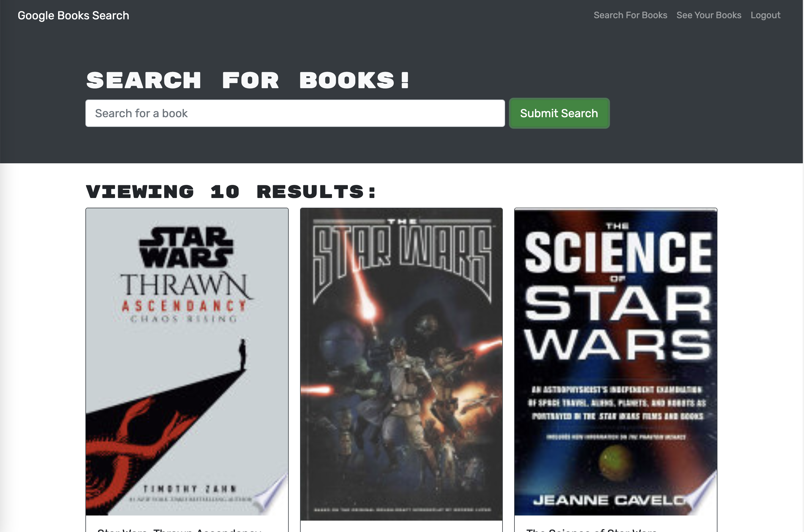

  # book-search

  ## Table of Contents

  * [Description](#description)  
  * [Installation](#installation)  
  * [Badges](#badges)  
  * [License](#license)  

  ## Description

  Book Search lets all book lovers find and save the books they desire to read! It is built with React using the MERN Stack.
  
  

  
  

  
  ## Installation
    
  ### Follow these instructions to install the project
  - To install the project, clone the GitHub Repo and install the necessary dependencies within the project root directory as well as the client and server directories.
  

  
  ## Usage
    
  ### Follow these instructions to use the project
  - To use the project, Navigate to our website at - https://murmuring-peak-47764.herokuapp.com/ - and make a profile!
  

  

  

  

  
  ## Badges

  
  
  
   
  

  
  ## License
  MIT License

  Copyright (c) 2021 zackaryanderson
    
  Permission is hereby granted, free of charge, to any person obtaining a copy
  of this software and associated documentation files (the "Software"), to deal
  in the Software without restriction, including without limitation the rights
  to use, copy, modify, merge, publish, distribute, sublicense, and/or sell    copies of the Software, and to permit persons to whom the Software is
  furnished to do so, subject to the following conditions:
    
  The above copyright notice and this permission notice shall be included in all
  copies or substantial portions of the Software.
    
  THE SOFTWARE IS PROVIDED "AS IS", WITHOUT WARRANTY OF ANY KIND, EXPRESS OR
  IMPLIED, INCLUDING BUT NOT LIMITED TO THE WARRANTIES OF MERCHANTABILITY,
  FITNESS FOR A PARTICULAR PURPOSE AND NONINFRINGEMENT. IN NO EVENT SHALL THE
  AUTHORS OR COPYRIGHT HOLDERS BE LIABLE FOR ANY CLAIM, DAMAGES OR OTHER
  LIABILITY, WHETHER IN AN ACTION OF CONTRACT, TORT OR OTHERWISE, ARISING FROM,
  OUT OF OR IN CONNECTION WITH THE SOFTWARE OR THE USE OR OTHER DEALINGS IN THE
  SOFTWARE.
    

  

  ### _MADE WITH README GENERATOR_
  
  
        
